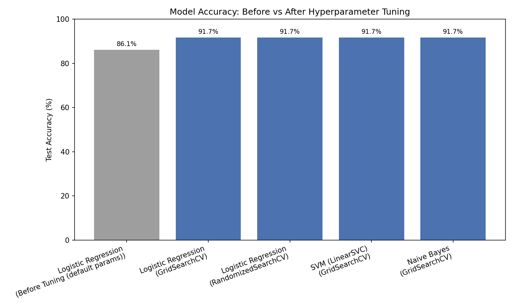

# Hyperparameter Tuning for NLP Sentiment Analysis

Tuning a text-classification model with **GridSearchCV** and **RandomizedSearchCV**,
and comparing performance before vs after tuning.

## 📌 Task

Sentiment analysis on movie reviews (positive / negative). The dataset is
intentionally noisy (negation, mixed-sentiment sentences, ~7% label noise)
so there's real room for hyperparameter tuning to improve results — a
dataset that's too clean would hit ~97% even with default settings and
wouldn't show anything useful.

## 📁 Folder Structure

```
Hyperparameter_Tuning/
│── dataset.csv              # 180-sample sentiment dataset (text, label)
│── preprocessing.py          # shared text cleaning (lowercase, remove
│                              #   punctuation, tokenize, remove stopwords,
│                              #   lemmatize) used by both scripts below
│── baseline_model.py          # untuned TF-IDF + Logistic Regression model
│── tuning.py                  # GridSearchCV + RandomizedSearchCV + bonus
│                              #   multi-model comparison + plot + save model
│── best_model.pkl             # saved best model (joblib) - generated by tuning.py
│── best_model_info.json       # which model won and its accuracy
│── baseline_results.json      # baseline accuracy/time - generated by baseline_model.py
│── comparison_results.csv     # full before/after comparison table
│── comparison_plot.png        # bar chart of all results
│── requirements.txt
│── README.md
```

## ▶️ How to Run

```bash
pip install -r requirements.txt

# 1. Train the untuned baseline model (do this first)
python baseline_model.py

# 2. Run hyperparameter tuning + comparison + prediction system
python tuning.py
```

`tuning.py` reads `baseline_results.json` so it can show the full
before/after table without retraining the baseline. At the end it will
prompt: `Enter text:` — type any sentence to get a live sentiment
prediction from the tuned model (or press Enter to see a demo prediction).

> First run needs internet access once, to download NLTK's `stopwords`,
> `wordnet`, and `punkt_tab` data. If offline, `preprocessing.py` falls
> back to a small built-in stopword list so the pipeline still runs.

## 🧹 Preprocessing Pipeline (`preprocessing.py`)

1. Lowercase text
2. Remove punctuation and digits
3. Tokenize (`nltk.word_tokenize`)
4. Remove stopwords (`nltk.corpus.stopwords`)
5. Lemmatize (`WordNetLemmatizer`)

## 🧠 Models & Feature Engineering

- **Feature engineering:** `TfidfVectorizer`
- **Baseline model:** Logistic Regression, all default hyperparameters
- **Tuned models:** Logistic Regression (Grid + Randomized search), plus
  SVM (`LinearSVC`) and Multinomial Naive Bayes as a bonus multi-model
  comparison — all wrapped in a single `Pipeline(TfidfVectorizer, classifier)`
  so vectorizer and model hyperparameters are searched together.

### GridSearchCV param grid (Logistic Regression)
```python
param_grid = {
    "tfidf__max_df": [0.85, 1.0],
    "tfidf__ngram_range": [(1, 1), (1, 2)],
    "clf__C": [0.1, 1, 10],
    "clf__solver": ["liblinear", "lbfgs"],
}
```

### RandomizedSearchCV param distribution (Logistic Regression)
```python
param_dist = {
    "tfidf__max_df": [0.75, 0.85, 0.9, 1.0],
    "tfidf__min_df": [1, 2, 3],
    "tfidf__ngram_range": [(1, 1), (1, 2), (1, 3)],
    "clf__C": [0.001, 0.01, 0.1, 1, 10, 100],
    "clf__penalty": ["l1", "l2"],
    "clf__solver": ["liblinear"],
}
```
Both use `cv=5` cross-validation.

## 📊 Results

| Model               | Method                          | Accuracy | Train Time (s) |
|---------------------|----------------------------------|:--------:|:---------------:|
| Logistic Regression | Before Tuning (default params)  | 86.11%   | 0.008 |
| Logistic Regression | **GridSearchCV**                | **91.67%** | 1.01 |
| Logistic Regression | RandomizedSearchCV              | 91.67%   | 0.74 |
| SVM (LinearSVC)      | GridSearchCV                    | 91.67%   | 0.28 |
| Naive Bayes          | GridSearchCV                    | 91.67%   | 0.29 |

**Best parameters found (GridSearchCV, Logistic Regression):**
`{'clf__C': 10, 'clf__solver': 'liblinear', 'tfidf__max_df': 0.85, 'tfidf__ngram_range': (1, 2)}`

- **Before tuning:** 86.11%
- **After tuning:** 91.67% (+5.56 points)
- **GridSearchCV vs RandomizedSearchCV:** on this dataset both searches
  converged to essentially the same accuracy, but RandomizedSearchCV
  reached it while only trying 20 sampled combinations vs GridSearchCV's
  24 exhaustive combinations — the gap grows fast on bigger grids, which
  is the whole point of using RandomizedSearchCV in real projects.
- All three tuned model families (Logistic Regression, SVM, Naive Bayes)
  landed at the same test accuracy here, which makes sense on a small
  (180-row) test set — with more data you'd typically start to see one
  model family pull ahead.



*(Exact numbers can shift slightly between runs since the dataset has
randomized label noise baked in — re-run `baseline_model.py` then
`tuning.py` to regenerate everything from scratch.)*

## 💾 Model Persistence

The single best-performing model across all searches is saved with
`joblib.dump()` as `best_model.pkl`, ready to be reloaded elsewhere:

```python
import joblib
from preprocessing import clean_text

model = joblib.load("best_model.pkl")
text = "The acting was fantastic and I loved the ending!"
prediction = model.predict([clean_text(text)])[0]
print(prediction)  # -> "positive"
```

## 🔧 Tools Used

Python, pandas, scikit-learn (`TfidfVectorizer`, `LogisticRegression`,
`LinearSVC`, `MultinomialNB`, `Pipeline`, `GridSearchCV`,
`RandomizedSearchCV`), nltk (stopwords, WordNetLemmatizer, tokenizer),
matplotlib, joblib.
